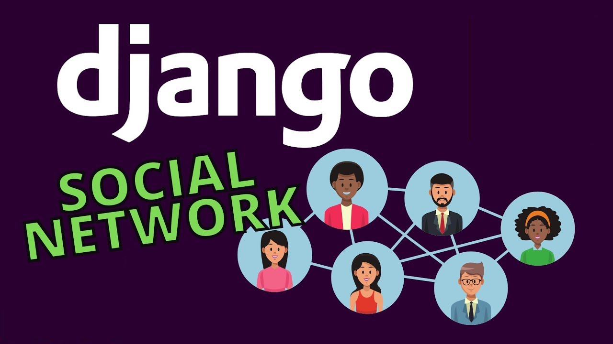

# django-social-network



Hello friends of this [Mr.Rezoo](https://www.linkedin.com/in/mrrezoo/)

## Table of contents

* [General info](#General-info)
* [Technologies](#Technologies)
* [Help](#Help)
* [Setup](#Setup)
* [Credits](#credits)
* [Contributors](#Contributors)
* [License](#license)

## General info

Work on sample social network with Django language . . .

Some features we worked on

* Templates -> DjangoTemplate Engine | filter , static , ...
* Model
* Manager
* Form
* Namespace
* Admin panel customization
* ckeditor
* Static file
* Media file

## Technologies

Project is created with:

* Python: 3.9
* Django: 3.2.3

## Help

If you are considering a particular method, more modern technology Add to my project and send merge request, I will add
you in the credits and contributors section

## Setup

* first step : create virtual environment

```shell
virtualenv -p python3 venv 
```

* second step : activate virtual environment

```shell
source venv/bin/activate  
```

* third step : install package | library from requirements.txt

```shell
 pip install -r requirements.txt
```

* last step run django server

```shell
 python manage.py runserver
```

## Credits

* [mongard](https://www.mongard.ir/courses/django-social)

## Contributors

* [MrRezoo](https://github.com/MrRezoo)

## License

Distributed under the MIT License. See [license](LICENSE) for more information.
